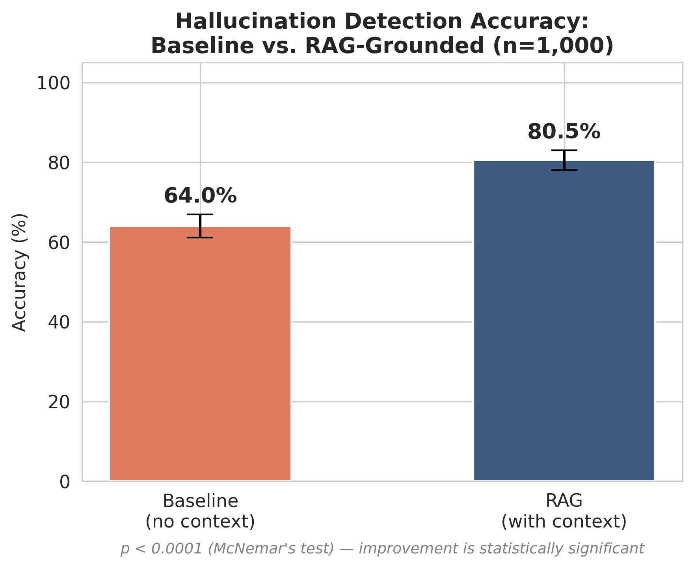
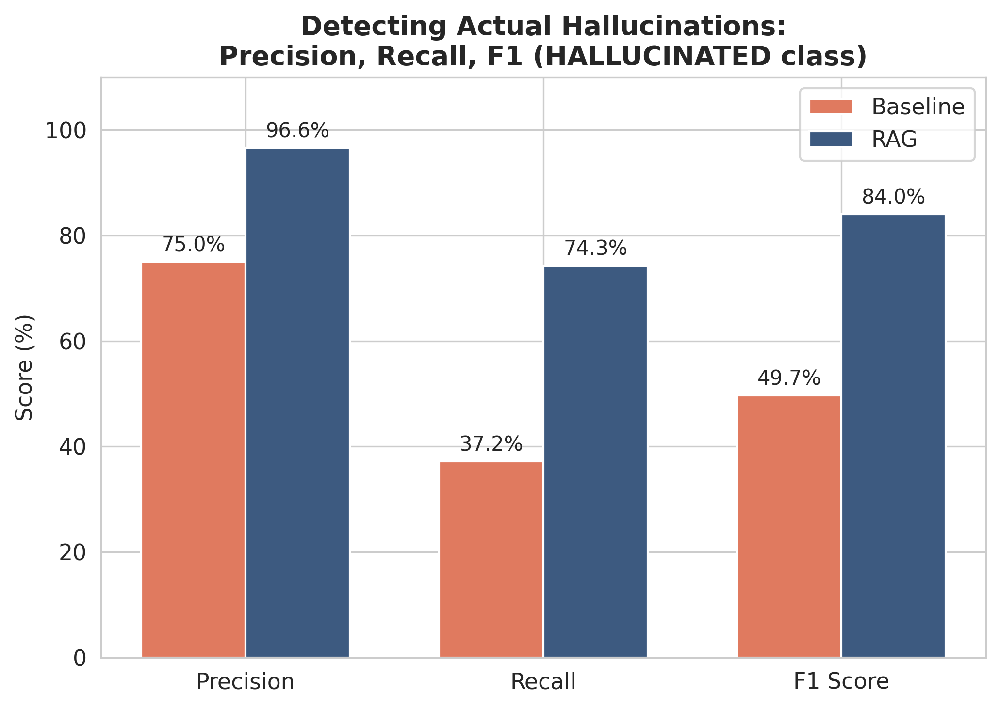
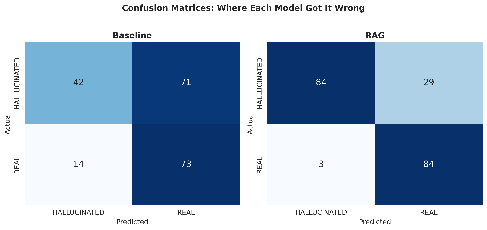

# Medical LLM Hallucination Detection with RAG Grounding

Testing whether giving a language model access to real source context (Retrieval-Augmented Generation) improves its ability to detect fabricated medical answers, compared to relying on the model's own unguided judgment.

## Motivation

Large language models are increasingly used to answer medical questions, but they can produce confident, plausible-sounding answers that are factually wrong ("hallucinations"). In a healthcare context, failing to catch a hallucinated answer is a genuinely dangerous failure mode. This project measures how much simply grounding the model in verified source text improves its ability to catch these errors.

## Dataset

[MedHallu](https://huggingface.co/datasets/UTAustin-AIHealth/MedHallu) — a public, MIT-licensed benchmark of 10,000 medical question-answer pairs built on top of PubMedQA, developed by UT Austin's AI Health group. Each row contains a question, the real source context, a correct ("Ground Truth") answer, and a fabricated ("Hallucinated") answer, labeled by difficulty and hallucination category.

All 1,000 labeled samples were used, with a fixed random assignment (seed=42, reproducible) of which answer (real or hallucinated) was shown for each question, held constant across both conditions for a fair paired comparison.

## Method

- **Model:** microsoft/Phi-3-mini-4k-instruct (open-source, run via Hugging Face Transformers)
- **Baseline:** the model is shown only the question and one answer (real or hallucinated), and asked to judge whether it's correct — no source material provided.
- **RAG-grounded:** the model is shown the same question and answer, plus the real source `Knowledge` text from the dataset, and asked to judge the answer *based on that context*.
- Both conditions were run on the **exact same 200 question/answer pairs**, with the same real-vs-hallucinated assignment per question, to allow a fair, paired comparison.

## Results

| Metric | Baseline (no context) | RAG (with context) |
|---|---|---|
| Overall accuracy | 57.5% (95% CI: 50.5–64.5%) | 84.0% (95% CI: 79.5–89.0%) |
| Recall on hallucinated answers | 37.2% | 74.3% |
| Precision on hallucinated answers | 75.0% | 96.6% |
| F1 (hallucinated class) | 49.7% | 84.0% |

The improvement is statistically significant (McNemar's test, p < 0.001, n=200 paired samples).

### Key finding

Without grounding, the model missed roughly **2 out of every 3 hallucinated answers** — a genuinely risky failure rate for a medical context. Grounding the model in real source text roughly **doubled its recall on hallucinations (37.2% → 74.3%)** while also improving precision, meaning it didn't just get more cautious across the board — it got specifically better at catching fabricated answers, with few false alarms.

### By hallucination category

Improvement held across all categories, though sample sizes vary considerably (from n=149 down to n=1 for the rarest category) — category-level results with fewer than ~20 samples should be read as directional, not statistically robust.

### Limitation

Even with grounding, the model's remaining errors were almost entirely false negatives (calling a hallucinated answer "correct"), rather than false positives. This suggests grounding alone narrows but doesn't eliminate the model's underlying bias toward accepting answers at face value — a direction for future work (e.g. combining this with explicit claim-by-claim fact verification against the source).

## Repository contents

- `medhallu-hallucination-detection.ipynb` — full notebook: data loading, baseline run, RAG run, statistical analysis
- `baseline_final.csv` / `rag_final.csv` — raw per-question results for both conditions
- `chart1_overall_accuracy.png`, `chart2_precision_recall_f1.png`, `chart3_confusion_matrices.png` — result visualizations

## Tech stack

Python, Hugging Face Transformers & Datasets, pandas, statsmodels (McNemar's test), scikit-learn (precision/recall/F1), matplotlib/seaborn. Run on Kaggle (free GPU).

## Author

Vignesh — undergraduate CS student, built as part of independent research toward a Master's application in Data Science / Computer Science.
